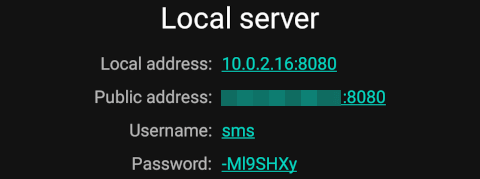

# Local Setup Guide

## 1. Capcom6 SMS Gateway Installation

Follow this step-by-step guide to install and run the Capcom6 SMS Gateway app on your local machine.  

---

### Installation Guide  

The recommended way to install the application is from a [prebuilt **APK**](https://github.com/capcom6/android-sms-gateway/releases).  

---

### Prerequisites  

- Android device with **Android 5.0 (Lollipop)** or later.  

---

### Required Permissions  

Grant the following permissions for full functionality:  

- **SEND_SMS** – Essential for sending SMS messages.  
- **READ_PHONE_STATE** – Allows SIM card selection, if utilized.  
- **RECEIVE_SMS** – Required for receiving SMS messages and sending `sms:received` webhook.  

---

### Installing from APK  

1. Visit the **Releases** page on GitHub.  
2. Download the most recent **APK**.  
3. Move the APK file to your Android device.  
4. On your device, go to **Settings > Security** (or **Privacy**).  
5. Enable **Unknown sources** to allow installations from non-Play Store sources.  
6. Use a file manager to locate the APK file.  
7. Tap the APK to begin installation.  
8. Complete the setup as prompted on-screen.  

---

### Local Server Mode  

This mode is ideal for sending messages from a **local network**.  

#### Steps to Enable Local Server  

1. Launch the app on your device.  
2. Toggle the **Local Server** switch to the **ON** position.  
3. Tap the **Offline** button at the bottom of the screen to activate the server.  
4. The **Local Server** section will display:  
   - Device’s **local IP address**  
   - Device’s **public IP address** (only accessible if you have a public/"white" IP and your firewall is configured properly)  
   - **Credentials** for basic authentication 
    
   

---

##  2. Expose Local Server via Ngrok

### a. Install `ngrok`:

Download from: https://ngrok.com/download

### b. Add your authtoken:

```bash
ngrok config add-authtoken <YOUR_NGROK_AUTHTOKEN>
```

> Get your authtoken from https://dashboard.ngrok.com/get-started/setup

### c. Start a tunnel on port `5000`:

```bash
ngrok http 5000
```

Copy the `https` forwarding URL shown, e.g.:

```
Forwarding https://abc123.ngrok.io -> http://localhost:5000
```

You'll use this for the webhook:  
```
https://abc123.ngrok.io/incoming-sms
```

---

##  3. Start the Webhook Server

Make sure you have Python ≥ 3.8 and `pip` installed.

### a. Install dependencies:

```bash
pip install -r requirements.txt
```

### b. Set environment variables

Create a `.env` file in the root with the following:

```env
DEVICE_IP=10.35.xxx.xxx
DEVICE_PORT=8080
APP_USERNAME=username 
PASSWORD=password
NGROK_URL=nrgok_url
AI_ENDPOINT=ai_agent_url
```

### c. Start the Quart server using Uvicorn

#### For Linux/macOS:

```bash
export $(grep -v '^#' .env | xargs)
uvicorn app:app --host ${HOST:-0.0.0.0} --port ${PORT:-5000}
```

#### For Windows (PowerShell):

```powershell
uvicorn app:app --host 0.0.0.0 --port 5000
```

---

##  4. Register the Webhook URL

With the server running and `ngrok` active run the `webhook.py` file

---

##  Notes

-  **Ensure mobile & laptop are on the same local network.**
-  **Capcom6 SMS Gateway works only with SMS/MMS and does not support RCS chat.**
-  Use `.env` to securely manage environment variables.
-  Use `ngrok` HTTPS URL (not HTTP or local IP) for external webhook registration.

---
